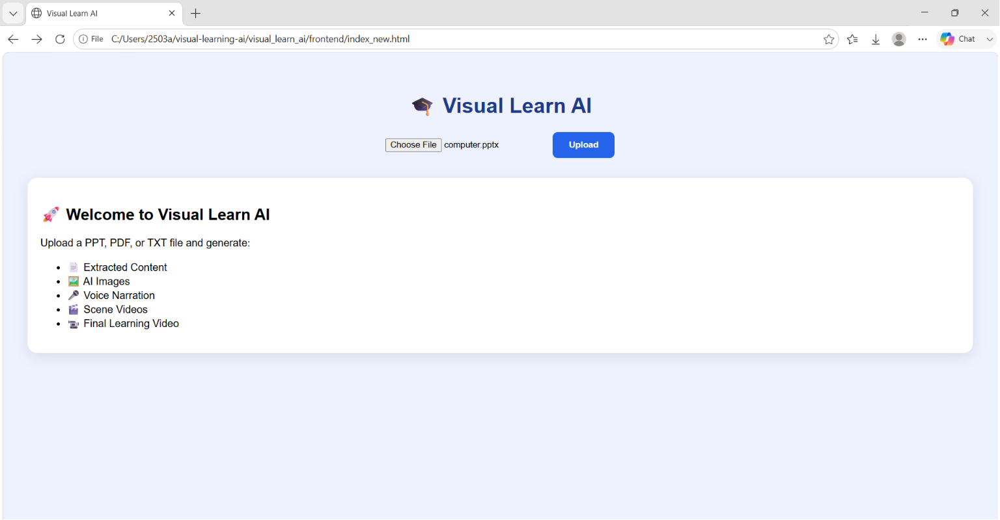
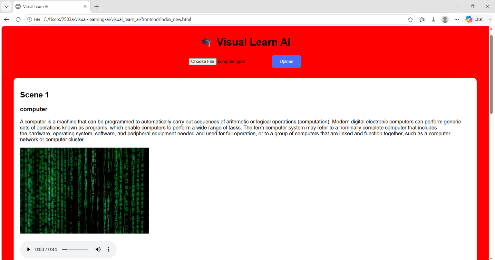
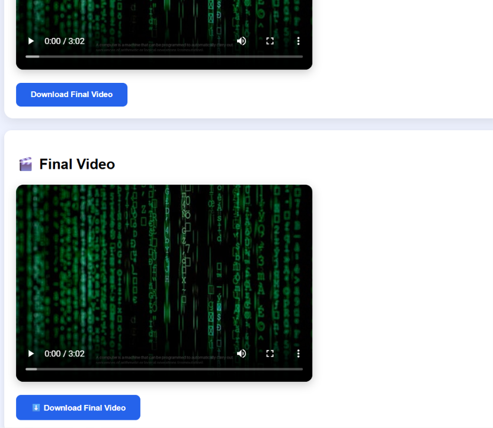

# Visual Learn AI

#Inspiration

While studying and interacting with students around me, I noticed that many of them struggled to understand long theoretical content from PDFs, PowerPoint presentations, and notes.

Reading large amounts of text often becomes tiring and makes learning less engaging. I wanted to create something that could make learning more visual, interactive, and easier to understand.

This observation inspired me to build "VISUAL LEARN AI".

# About the Project

Visual Learn AI is an AI-powered educational tool that transforms learning materials into visual video content.

The system accepts educational documents such as PDFs, PowerPoint presentations, and text files, extracts the important information, generates relevant scenes and images, creates voice narration, and combines everything into an educational video.

Instead of reading pages of theory, students can learn through automatically generated visual explanations.

## Problem Statement

Many students find it difficult to stay engaged while reading lengthy theoretical content.

Traditional study materials often lack visual representation, making complex topics harder to understand and remember.

## Solution

Visual Learn AI converts educational content into visual learning experiences by:
- Extracting content from PDF, PPT, and TXT files
- Generating scene-wise explanations
- Fetching relevant educational images
- Creating voice narration using Text-to-Speech
- Combining scenes, images, and audio into a final educational video

  # Screenshots

## Home Page

## Upload & Processing

## Final Video Output

## Technologies Used

- Python
- Flask
- HTML
- CSS
- JavaScript
- Pexels API
- gTTS (Google Text-to-Speech)
- MoviePy

## Workflow

Upload File
      ↓
Extract Content
      ↓
Generate Storyboard
      ↓
Fetch Images
      ↓
Generate Audio
      ↓
Generate Subtitles
      ↓
Create Scene Videos
      ↓
Merge Videos
      ↓
Final Educational Video
## Future Improvements

- AI-generated images instead of stock images
- Multiple voice options
- Better animations and transitions
- Multi-language support
- Cloud deployment for public access

## Impact

The goal of this project is to make learning more engaging and accessible by converting static educational content into visual explanations.

By combining AI, image generation, narration, and video creation, Visual Learn AI aims to help students understand concepts faster and retain information more effectively.
